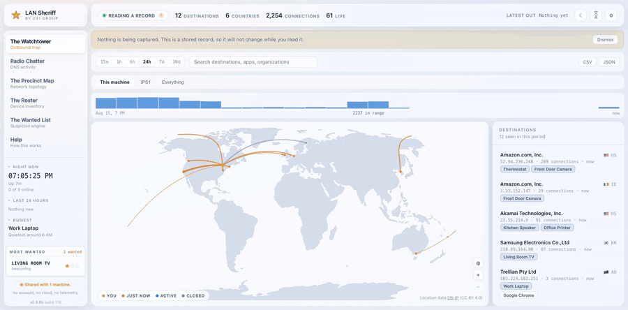
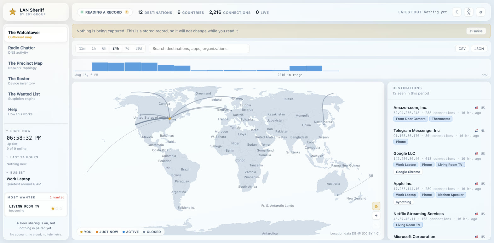
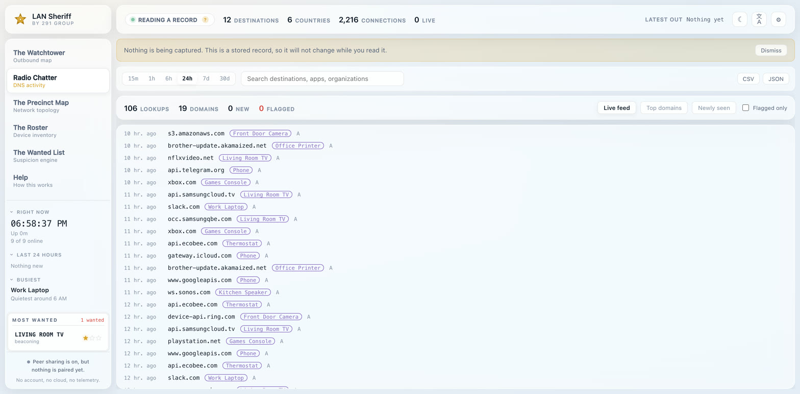
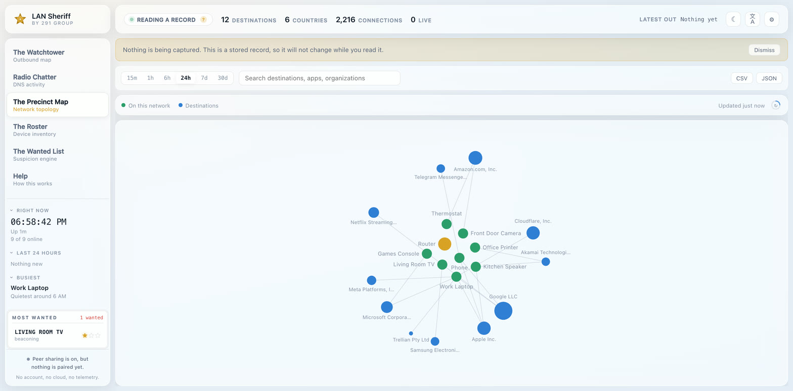
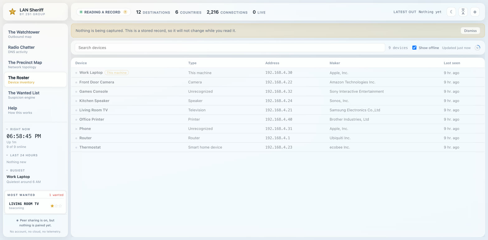
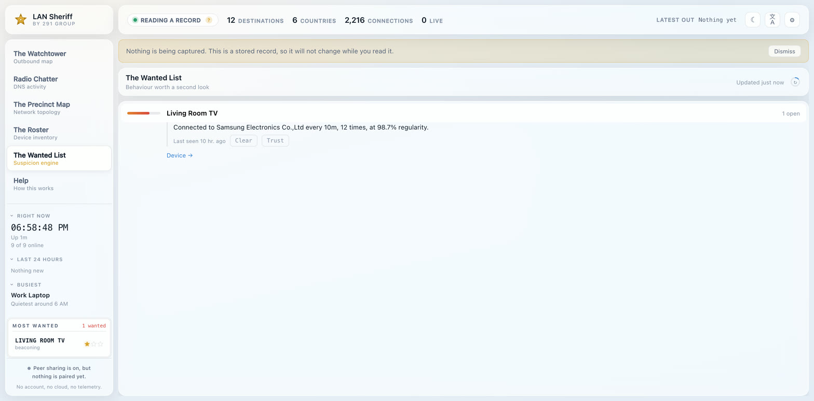
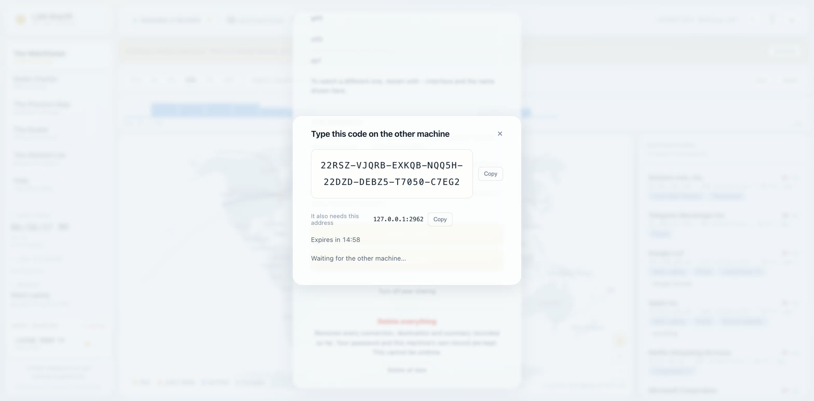
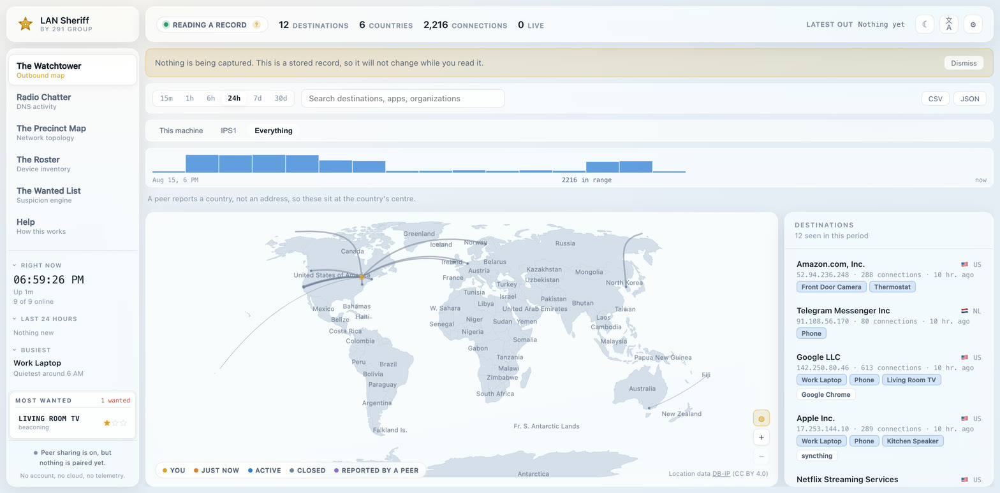
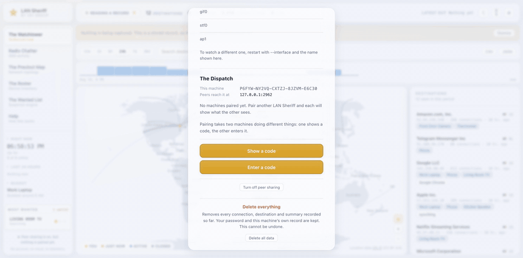
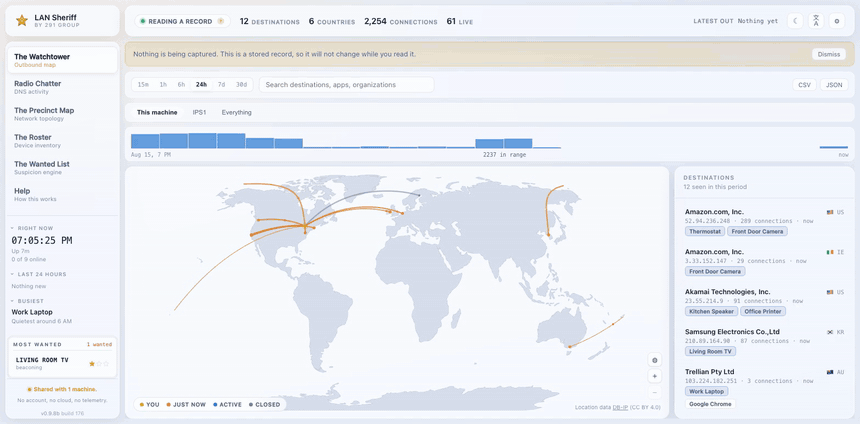

<h1 align="center">LAN Sheriff</h1>

<p align="center"><em>"Nothing leaves town unnoticed."</em></p>

<p align="center">
  <a href="https://github.com/291-Group/LAN-Sheriff/actions/workflows/ci.yml"></a>
  <a href="#license"></a>
  
  
  <a href="https://hub.docker.com/r/291group/lan-sheriff"></a>
</p>

> **v1.0.1, released 23 August 2026.** Twelve platform binaries, checksums signed
> keylessly through sigstore, and an SBOM in every archive. It ships **unsigned by a certificate authority**,
> which your operating system will mention the first time; [why, and what to do about
> it](#your-computer-will-warn-you-the-first-time). A signed build follows as a point release and changes
> nothing about the software.

---

**291 LAN Sheriff** is a self-hosted, open-source network monitor. It shows you everything your devices send
out to the internet (live, on a map) and flags what doesn't belong.

Your devices talk to the internet constantly, and almost none of it is you. Phones, laptops, TVs,
thermostats and doorbells quietly send data to servers around the world all day: apps checking in, telemetry,
trackers, ad networks, and occasionally something that should not be there at all. Normally this is
invisible. LAN Sheriff makes it visible. You run one program, a browser opens, and with no configuration you
see in real time what your network is sending, where it goes, and who owns the other end.

<p align="center">
  
</p>

<p align="center"><sub>A sample of what it looks like in use.<br>
Everything shown is a synthetic network; no real one appears anywhere in this repository.</sub></p>

From the same people as [LAN Orangutan](https://github.com/291-Group/LAN-Orangutan), which finds what is on
your network. This one watches what it does. [More on how the two fit together](#from-the-people-who-made-lan-orangutan).

### Why you'd run it

- **Curiosity**, plug in a new smart TV and watch it phone home to a dozen tracking companies within
  seconds. Most people have no idea how much their devices chatter.
- **Privacy**, see who your devices actually share data with, rather than taking a company's word for it.
- **Security**, if something is compromised, or a gadget starts beaconing to a server it has never used
  before, this is how you notice. That is the sheriff's actual job: spotting the one thing that doesn't belong.
- **Understanding your setup**, it draws a live map of how everything is connected, which almost nobody has.

## How it runs

Two modes, detected automatically. **Neither requires configuration.**

|  | Deputy Mode *(default)* | Patrol Mode *(optional)* |
|---|---|---|
| Privileges | **None** | Elevated (libpcap / Npcap) |
| Sees | This machine's own connections | Every device that passes its vantage point † |
| Names the application | **Yes**, exactly | No, it isn't in the packets |
| DNS visibility | No | Yes |
| Device discovery | Yes | Yes |

† **The vantage point is the catch, and it is worth understanding before you install anything.** A switch
forwards a device's traffic only to the port it is destined for, so a machine plugged into one sees its own
traffic and broadcast, not what the television is sending. To see other devices, LAN Sheriff has to sit
where their traffic already goes: on the router, or on a mirror/SPAN port. Without that, Patrol Mode still
adds DNS visibility and device discovery, and the dashboard says so plainly rather than showing you an empty
screen. [docs/VANTAGE-POINTS.md](docs/VANTAGE-POINTS.md) covers the arrangements that work, and which routers
can actually run it.

These are complementary rather than a ladder, and the table above describes each source rather than what you
end up looking at. **They run together**, and the dashboard shows the union, so enabling Patrol Mode costs
you nothing: application names keep arriving from the socket tables while DNS, traffic volumes and other
devices arrive from the wire. Deputy Mode ties every connection to the exact application that opened it,
which packet capture can never do, that fact is not on the wire. Patrol Mode sees the devices that cannot
run software: the television, the thermostat, the doorbell.

The one consequence worth knowing in advance is that another device's connection can never carry an
application name, because that fact exists only on the machine that opened it. A screen with some
connections named and others not is correct rather than half-broken.

If elevated access isn't available, LAN Sheriff runs in Deputy Mode and tells you plainly what you would
gain, rather than rendering an empty screen. See [docs/VANTAGE-POINTS.md](docs/VANTAGE-POINTS.md) for why an
empty roster usually isn't an empty network.

## What's in it

**The Watchtower**, a live world map with arcs to every external server your traffic reaches. Click a
destination for country and city, the owning organization, reverse DNS, protocol, port, byte counts,
duration, and the responsible app or device. Filter by device, app, country, organization or protocol; watch
live or scrub back through history.

<p align="center"></p>

**Radio Chatter**, a readable stream of every DNS lookup: who asked, for what, what it resolved to, and how
fast. Surfaces top domains, first-seen domains, and lookups to known tracker, ad, telemetry or malware
domains, *labelled, never blocked*. Requires Patrol Mode, or a machine that is itself the resolver.

> **Encrypted DNS is invisible here, and increasingly that is most of it.** DNS over HTTPS and DNS over TLS
> travel on 443 and 853 and cannot be read without intercepting TLS, which this never does. Chrome, Edge and
> Firefox enable it by default in many configurations, and Windows 11 supports it system-wide, so a modern
> machine can show a busy Watchtower beside an empty Radio Chatter and nothing is wrong. `nslookup example.com`
> always uses plain port 53 and is the quickest way to tell a quiet network from a blind spot. The dashboard
> says the same thing where the feed would otherwise just look broken.

<p align="center"></p>

**The Precinct Map**, a network diagram generated from observed traffic, with no manual input. Devices are
nodes, observed connections are links.

<p align="center"></p>

**The Roster**, every device seen: online state, first and last seen, IP, MAC, manufacturer, hostname,
inferred type, and services. Label devices, mark them deputized or watched.

<p align="center"></p>

**The Wanted List**, the suspicion engine, and what sets this apart. Eight rules, each written around the
specific false positive that would otherwise make it useless:

<p align="center"></p>

### Two machines, paired

<p align="center"></p>

<p align="center"></p>

Pairing is two machines doing different things: one shows a forty-character code, the other types it. After
that each draws the other's destinations. A peer sends an organization, a country and counts, never an
address and never a domain, which is why its arcs sit at the centre of a country rather than on a city.

<p align="center"></p>

| Rule | Fires on |
|---|---|
| `first_contact` | A device reaches an organization it never has, scored by how unusual that is *for that device* |
| `beaconing` | The same destination at a very regular interval |
| `rare_destination` | A part of the internet this network essentially never uses |
| `dga_domain` | Several machine-generated domain names that don't resolve |
| `port_scan` | Many ports on one host, or one port across many hosts, mostly refused |
| `plaintext` | Credentials or private data sent unencrypted |
| `volume_anomaly` | A device doing far more than *its own* normal |
| `threat_list` | A lookup to a domain on a published malware list |

Every finding explains itself in plain language built from its own facts, *"Sent FTP traffic to a hosting
provider unencrypted, 73 times"*, so it is a judgement you can check rather than a black box.
There is no list of suspicious countries; comparisons are only ever against your own network's history.

**The Dispatch**, one vantage point cannot see a whole house, so instances pair with each other and
exchange hourly summaries: a device, an organization, a country, an application and counts. Never addresses,
never the domains looked up, never an individual connection. Off until you turn it on, paired by carrying a
code between two machines, and refused on any address that is not on your own network. There is no server in
the middle. See [docs/DISPATCH-PROTOCOL.md](docs/DISPATCH-PROTOCOL.md).

**Everything else**, global search across destinations, domains, devices and apps. CSV and JSON export of
any view. Outbound alerts to webhook, ntfy, Discord or Slack, all off unless configured. A bounded,
self-pruning rolling history, so it is safe to leave running on a Pi for weeks. Full interface in 12
languages including right-to-left Arabic and Hebrew.

**It never blocks, drops, or modifies traffic.** Capture is entirely passive: no code path writes a packet
to the wire, refuses one, or answers on behalf of anything. Device *discovery* is the one active part, it
sends a small probe to each local address so devices that never talk to this machine are still found, which
`--sweep=false` turns off.

<p align="center">
  
</p>

<p align="center"><sub>Every view in turn, then two machines pairing.</sub></p>

## Philosophy

**Everything here can be done with tools that do it better.** Wireshark will show
you every byte. Zeek will turn a link into structured logs an analyst can query.
ntopng draws far richer graphs. Suricata will actually catch intrusions, which
this does not attempt. pfSense or OPNsense sit where the traffic really is. All
of them are more capable than LAN Sheriff and none of that is in dispute.

The gap they leave is not capability. It is the first hour.

Each of those asks you to know what you are looking for before it will tell you
anything. Pick an interface, choose a filter, learn what a normal baseline is,
often find a spare machine to put it on. That is entirely reasonable for somebody
whose job this is. It is why almost nobody else ever starts, and why most people
have never once seen what their television talks to overnight.

So the bet here is narrow: **one binary, no configuration, and something true on
the screen within a minute of starting it.** No account, no cloud, no agent on
every device, nothing to point at anything. Run it and it already knows which
applications on this machine are talking to whom, and where those places are.
Everything after that is an attempt to answer the obvious next question without
requiring a course first.

That has costs, and they are stated rather than hidden. It observes and never
blocks. It stores no payloads, so there is nothing to go back and read. Without a
vantage point it sees this machine rather than the network, which is the ordinary
case and [says so on screen](#choosing-what-to-watch). It will not tell you that
you have been breached; it will tell you that a device which has talked to three
places for a year has started talking to a fourth, and leave the judgement to you.

If you outgrow it, the tools above are waiting and this will have taught you what
to point them at. That is a good outcome, not a defeat.

## Not in v1.0.0, and what comes next

Stated here rather than left to be discovered, because a list of what a tool
does not do is worth more than another paragraph about what it does. Where
something is already written and simply held back, it says so and when.

**Already written, landing in the next release.** A signed build, once Apple
Developer enrolment completes; it needs a D-U-N-S number that had not arrived by
release day, and nothing about the software changes when it lands.

Everything below is further out, and each says why.

**PCAP export.** Exporting a packet capture for one connection, to open in
Wireshark. It is not a small addition: this product's central claim is that it
stores no payloads, and a packet capture is payloads. Doing it honestly means
capturing fresh for a chosen flow, with a size cap, a time limit, and the
interface saying plainly what is being written and where. That is a design, and
it is v2.

**Patrol Mode on OpenWrt and BSD firewalls.** The two places a network monitor
most wants to live, and the two it cannot reach yet. OpenWrt builds against musl
and many of its devices are mips; the released Linux binary links glibc
deliberately, because a fully static glibc build breaks name resolution and this
one resolves names. pfSense and OPNsense are FreeBSD, which today is served only
by the capture-free portable build.

**Email notifications.** Webhook, ntfy, Discord and Slack all work. Email needs
either an SMTP configuration for every user or a relay we would have to run, and
a tool that promises nothing leaves your machine should not quietly acquire a
mail server.

**The AUR package.** Written and not published: Arch disabled AUR package
adoption in July 2026 after a wave of malicious takeovers, and pushes with it.
Arch users can use `install.sh` or build from source in the meantime.

**Reviewed translations.** All twelve languages ship, and only the English has
been written by a native speaker. Corrections are the single most useful thing
anyone can contribute, and they will be taken gratefully.

## Install

**v1.0.1 is on the [releases page](https://github.com/291-Group/LAN-Sheriff/releases).** Twelve binaries, five
with packet capture and seven portable. [Building from source](#build-from-source) is one command if you would
rather.

Use the command for your system and you never have to choose a file. If you would rather download one by
hand, [which file do I want?](#which-file-do-i-want) explains the two builds and which platforms get which.

### Before you start

**Nothing is required to run it.** Deputy Mode works the moment you start it, on every platform, with no
privileges and nothing to install: it names the application behind every connection this machine makes, lists
the devices on your network, and draws the map. If that is what you want, skip this section entirely.

**Patrol Mode is the part with a prerequisite**, and it is worth doing before the first run rather than after,
because otherwise you start it, read a banner telling you what is missing, stop it, install something, and
start again. Patrol Mode adds DNS lookups and other devices' traffic.

| | What Patrol Mode needs | Do this first |
|---|---|---|
| **macOS** | Access to the BPF devices | Nothing to install. Run it with `sudo lan-sheriff`. If you have Wireshark, its ChmodBPF helper already grants this and no `sudo` is needed. |
| **Windows** | [Npcap](https://npcap.com), a separate free download | Install Npcap from <https://npcap.com>, tick nothing unusual in its installer, then run LAN Sheriff from an Administrator PowerShell. It cannot be bundled: its licence forbids redistribution. |
| **Linux, from `.deb`/`.rpm`/`.apk`** | Capture capabilities | **Nothing.** The package ships a systemd unit that grants them to a service account, so `systemctl start lan-sheriff` is the whole story. |
| **Linux, from an archive** | Capture capabilities | `sudo /sbin/setcap cap_net_raw,cap_net_admin=eip ./lan-sheriff` once, then run it normally. The `/sbin/` is not decoration: `setcap` lives there and `/sbin` is not on an ordinary user's `PATH`, so the bare name gives "command not found". Or just `sudo ./lan-sheriff` each time. libpcap is linked statically, so there is nothing else to install. |
| **FreeBSD, 32-bit ARM, Windows on ARM** | Not available | No capture build is published for these. Deputy Mode is the whole product there, and the app says so rather than leaving you looking. |

### Running it as a service

Everything above runs it from a terminal, which stops when the terminal does. To install it so it starts
with the machine instead:

```sh
sudo lan-sheriff install            # macOS, Linux
lan-sheriff install                 # Windows, from an Administrator PowerShell
```

That copies the binary onto your `PATH`, registers it with launchd, systemd, OpenRC or the Windows service
manager, and starts it. It keeps the same conventions as the `.deb`: a `lan-sheriff` service account on
Linux, its data in `/var/lib/lan-sheriff` at `0700`, capture privilege from the service definition rather
than from bits on the file, and the dashboard on localhost until you say otherwise with `--listen`.

`lan-sheriff uninstall` reverses it, and leaves the database alone unless given `--purge`. The record of a
network is not something to delete as a side effect of uninstalling the thing that collected it.

Not available on FreeBSD: the binaries run there, but no service definition has been tested, and an
untested `rc.d` script that writes to `/etc` does not belong in a release.

**A prerequisite is never fatal.** Without any of the above, LAN Sheriff still starts, still works, and says on
screen which mode it is in and what the other one would add. Nothing silently does less than you asked for.

One thing no prerequisite can buy: **seeing other devices' traffic needs a vantage point**, not just privilege.
See the [footnote above](#how-it-runs).

### macOS

**Homebrew is the easiest path, and it removes the unsigned-binary warning for you:**

```sh
brew install 291-group/tap/lan-sheriff
```

That is this project's own tap rather than homebrew-core, which has notability thresholds a new project
cannot meet. The cask clears the quarantine attribute as it installs, so macOS does not report the binary as
coming from an unverified developer.

To download it by hand instead, take `lan-sheriff_<version>_darwin_arm64.tar.gz` (Apple silicon)
or `lan-sheriff_<version>_darwin_amd64.tar.gz` (Intel) from the
[releases page](https://github.com/291-Group/LAN-Sheriff/releases), or use [install.sh](#anything-else), which
picks the right one. The archive contains a binary named `lan-sheriff`, plus its licence and checksums.

```sh
cd ~/Downloads && tar -xzf lan-sheriff_*_darwin_arm64.tar.gz
rm -f ~/lan-sheriff                       # see the note below before you skip this
mv ~/Downloads/lan-sheriff ~/lan-sheriff
chmod +x ~/lan-sheriff && xattr -c ~/lan-sheriff
~/lan-sheriff
```

The `rm` matters on an upgrade rather than a first install: macOS caches a signature against the file, so
copying a new binary over an old one leaves the record describing contents that are gone, and the new copy is
killed the instant it launches with no message at all. Delete first, or `mv` into place.

That runs Deputy Mode, unprivileged, which is right for most people. Patrol Mode is `sudo lan-sheriff`.

### Windows

**Scoop:**

```powershell
scoop bucket add 291group https://github.com/291-Group/scoop-bucket
scoop install lan-sheriff
```

To download it by hand instead, take `lan-sheriff_<version>_windows_amd64.tar.gz` from
the [releases page](https://github.com/291-Group/LAN-Sheriff/releases).

Windows 10 and 11 unpack a `.tar.gz` without anything extra. In PowerShell:

```powershell
cd ~\Downloads
tar -xzf lan-sheriff_*_windows_amd64.tar.gz
.\lan-sheriff.exe
```

The `.\` is not optional: PowerShell will not run a program from the current directory without it, and
`lan-sheriff.exe` on its own reports that it is not recognised.

Windows shows a SmartScreen warning and a firewall prompt the first time. The firewall one matters: dismiss it
and other machines cannot reach this one, and pairing will report that the address could not be reached.

Patrol Mode additionally needs [Npcap](https://npcap.com), which cannot be bundled: its licence forbids
redistribution. Without it the binary still runs, in Deputy Mode, and says which one it is using.

### Your computer will warn you the first time

It should, and this section is here rather than buried because a security tool that
acts surprised by a security warning has not thought about it.

**These builds are not signed with a paid certificate**, and that is worth stating plainly
rather than leaving you to discover it at the first warning dialog.

A signed build is coming. Apple Developer enrolment requires a D-U-N-S number, which had
not arrived in time, and the account cannot be opened without one. Waiting would have held
a finished product for a registration number, so **v1.0.0 ships unsigned on every platform
and a signed build follows as a point release** once the account exists. Nothing about the
software changes when it does; the signature says who published it, not what it does.

Until then the guarantee on offer is a different one, and arguably stronger, because it
costs nothing and cannot be stolen:

- `checksums.txt` is signed **keylessly with sigstore**, so the signature proves the file
  came out of this repository's release workflow and no private key exists for anyone to
  steal. Verify it with the command under [Checks](#checks).
- Every archive carries an SBOM listing exactly what went into it.
- The whole thing is source you can read, and one command to build yourself.

**On macOS** you will see *"cannot be opened because the developer cannot be verified"*.
The download carries a quarantine flag; clear it, or right-click the binary and choose Open
the first time:

```sh
xattr -c ~/lan-sheriff
```

**On Windows** SmartScreen says *"Windows protected your PC"* and hides the run button.
Click **More info**, then **Run anyway**. Windows will separately ask about the firewall,
and that prompt does matter: dismiss it and other machines cannot reach this one, and
pairing will report an address it could not reach.

**A firewall like Little Snitch** will add that the process has no code signature and the
developer is anonymous. That is a fair description of an unsigned binary, and it is the
same statement as the two above.

If any of that is a dealbreaker, build from source. It is one command, and then the binary
is yours rather than ours.

### Arch

**Not published yet, and not by choice.** Arch disabled AUR package adoption in July 2026 after a wave of
malicious takeovers. The `PKGBUILD` is written and will be submitted when adoption reopens; until then use
[install.sh](#anything-else) or build from source.

The package is the `-bin` one when it does land: building from source would mean every user installing a Go
toolchain and libpcap headers to produce a binary they could have downloaded, and the release links libpcap
statically anyway.

### Debian, Ubuntu, Fedora, RHEL, Alpine

`.deb`, `.rpm` and `.apk` packages are attached to each release, with a systemd unit and an OpenRC script.
Download the one for your architecture from the
[releases page](https://github.com/291-Group/LAN-Sheriff/releases), then:

```sh
sudo dpkg -i lan-sheriff_*.deb        # Debian, Ubuntu
sudo rpm -i lan-sheriff-*.rpm         # Fedora, RHEL
sudo apk add --allow-untrusted lan-sheriff_*.apk   # Alpine
```

The exact filenames follow each packager's own convention, which is why they are globbed here rather than
written out: `.deb` and `.rpm` do not agree on how to spell a version or an architecture, and a name copied
into a README is a name that goes stale at the first release that changes one.

The unit grants `CAP_NET_RAW` and `CAP_NET_ADMIN` so Patrol Mode works without running as root.

### Anything else

```sh
curl -fsSL https://raw.githubusercontent.com/291-Group/LAN-Sheriff/main/install.sh | sh
```

The installer verifies the published checksum before installing anything, and there is no flag to skip that.
It is ninety lines of POSIX shell, and reading a script before piping it into your shell is a reasonable
habit with any of them, particularly this one.

### Docker

```sh
docker compose up -d
```

The image is published to both registries, the same build in each:

```
ghcr.io/291-group/lan-sheriff        what docker-compose.yml uses
291group/lan-sheriff                 Docker Hub, for docker pull 291group/lan-sheriff
```

The two namespaces differ by a hyphen because ghcr follows the GitHub
organisation and Docker Hub does not. Neither is a typo.

Two settings in `docker-compose.yml` are not defaults and not optional, and both are explained in the file.
`network_mode: host` is the important one: a container on the default bridge watches Docker's own virtual
network, so the dashboard comes up, the Roster lists nothing but other containers, and the map stays empty.
That is the vantage-point problem again, reached through container networking instead of through a switch.
On Docker Desktop for macOS and Windows the container runs inside a Linux VM, so "host" is that VM rather
than your laptop; run the binary directly there.

### Umbrel, CasaOS, Runtipi, Unraid

Manifests for all four live in [`packaging/appstores/`](packaging/appstores/) and will be submitted once the
image is published. Read the note there first: a home server sits *on* the network rather than between it and
the internet, so Patrol Mode on one sees that machine and broadcast and little else. That is not a defect, and
it is not what most people expect from a network monitor.

### Which file do I want?

A release carries a couple of dozen files. Every command above picks the right one, verifies its checksum and
spares you the list, so this section is only for downloading by hand.

Some platforms get **two builds of the same program**:

|  | **Standard** | **Portable** (`_portable` in the name) |
|---|---|---|
| Patrol Mode | **Yes** | No, Deputy Mode only |
| Needs | libpcap on Linux, [Npcap](https://npcap.com) on Windows | Nothing at all |
| Built for | Linux amd64 · arm64, macOS Intel · Apple silicon, Windows amd64 | Linux amd64 · arm64 · arm, Windows amd64 · arm64, FreeBSD amd64 · arm64 |

**Take the standard build unless your platform appears only in the portable column.** Portable exists for the
places a capture build cannot reach: FreeBSD, which is what pfSense and OPNsense are, 32-bit ARM, which is
the older Raspberry Pis, and Windows on ARM. It is the same program with the same dashboard and it sees this
machine's own connections rather than the network's.

Picking wrong is recoverable and obvious: the dashboard names the build it is running and says what the other
one would add. Nothing silently does less than you think.

On Linux, prefer the `.deb`, `.rpm` or `.apk` over either archive. They carry the service unit that grants
capture privilege without running the whole program as root.

## Build from source

Requires Go 1.25+. Node 20+ is only needed to rebuild the dashboard, the built dashboard is committed, so
`go build` alone produces a working binary.

```sh
git clone https://github.com/291-Group/LAN-Sheriff
cd LAN-Sheriff
make run
```

Opens on <http://localhost:2911>. No configuration, and no elevated privileges for Deputy Mode.

For Patrol Mode, `make patrol` builds with packet capture (needs libpcap headers, or Npcap on Windows).

## Checks

`make check` runs everything CI runs. Beyond `go vet`, `staticcheck`, `govulncheck` and the tests, three
checks cover ground no compiler reaches:

| Check | Catches |
|---|---|
| `scripts/check-css-vars.mjs` | A CSS custom property used with no fallback and never defined. This invalidates the whole declaration, silently removing layout. |
| `scripts/check-i18n.mjs` | Mixed-script damage in the translation catalogues. TypeScript guarantees every language has every key; it cannot see a key that is present and wrong. |

## Documentation

| Document | What's in it |
|---|---|
| [docs/VANTAGE-POINTS.md](docs/VANTAGE-POINTS.md) | Why capture privilege alone doesn't show you the network |
| [docs/REMOTE-ACCESS.md](docs/REMOTE-ACCESS.md) | Reaching the dashboard from another machine, safely |
| [docs/DISPATCH-PROTOCOL.md](docs/DISPATCH-PROTOCOL.md) | Threat model and wire protocol for peer sharing |
| [CONTRIBUTING.md](CONTRIBUTING.md) | Building it, running the checks, and the conventions that are not obvious |
| [SECURITY.md](SECURITY.md) | Reporting a vulnerability |

## Privacy

**By default, nothing this tool observes ever leaves the machine it runs on.** No account, no cloud service,
no telemetry, no phone-home. The database is local, and nothing it records is uploaded anywhere.

Being precise about what *does* go out, since "no cloud" is easy to say and worth checking:

| Request | What it discloses | Default |
|---|---|---|
| GeoIP and blocklist datasets | That somebody downloaded a file. Nothing about you | On (`--city-db=false`, and the lists are small) |
| **Public-address lookup** | Your public IP, to `api.ipify.org`, so the map knows where to draw *from* | On (`--locate=false`). Asked **once per install**, the answer is remembered |
| Registration lookup (RDAP) | The address you asked about, to that registry | **Off.** Only when you click a specific destination |

None of them carry anything observed. The public-address lookup is the one worth knowing about: it is a
third party learning your IP, which is the unavoidable cost of asking "where am I". Turn it off with
`--locate=false` and the map draws from a neutral point and says so.

Two features can send data out, and **both are off until you switch them on**:

| Feature | What leaves | Where it goes |
|---|---|---|
| **Alerts** (`--notify-*`) | Rule name, subject, score, time. Deliberately thin, a notification often lands on a lock screen | The webhook, ntfy, Discord or Slack endpoint you configured |
| **The Dispatch** (`--dispatch`) | Hourly summaries: device, organization, country, application, counts. **Never** addresses, hostnames, looked-up domains, or anything about an individual connection | Only instances you explicitly paired by carrying a code between them. Directly, on your own network, no server in the middle, no third party |

The dashboard says which of these is true for *your* instance rather than repeating the default claim: turn
peering on and the footer stops saying "stays on this machine" and starts naming how many machines you paired.
A privacy statement that is only true in the default configuration is worse than a weaker one that is always
true.

LAN Sheriff observes traffic and never blocks, drops or modifies it. Run it on networks you own or administer.

**`lan-sheriff status`** answers, from a terminal and without a running instance, whether this machine is
sharing with anyone and whether it ever was, including pairings that were later removed.
[SECURITY.md](SECURITY.md) discusses what this tool can and cannot be misused for, including the case it
cannot prevent.

## The Dispatch: peer sharing, and how it is secured

One machine sees one vantage point. A laptop knows what the laptop did; it knows nothing about the television
downstairs. Peer sharing is the answer to that: two or more instances pair with each other and each shows what
the others have seen.

It is **off until you switch it on**, and switching it on shares nothing by itself. Nothing moves until you
pair a machine, and pairing is deliberately manual.

### Pairing

One machine shows a code, the other types it in. You carry the code between them yourself, which is what makes
a server in the middle unnecessary.

1. Turn peer sharing on in The Dispatch on both machines.
2. On one, choose **Show a code**. It displays a code and the address to reach it at. The code lasts five
   minutes and works once.
3. On the other, choose **Enter a code** and give it that address and code.

The machine entering the code is the one that connects, so it is the one that needs to be able to reach the
other. Paired machines then talk on **port 2912**, not the dashboard's port.

### What the connection actually is

| | |
|---|---|
| **Encryption** | TLS 1.3, and only 1.3. Not a minimum with a higher ceiling: both ends are pinned, so there is no downgrade to negotiate |
| **Authentication** | Mutual. Both ends present a certificate and both ends verify. A connection presenting no certificate dies in the handshake |
| **Identity** | An Ed25519 public key, pinned by you during pairing. There is no certificate authority to mis-issue one and no hostname to spoof. An unpaired key is rejected inside the handshake, before a single byte of application data is read |
| **Forward secrecy** | Yes, from TLS 1.3's ephemeral key exchange. Recording the traffic today and stealing a key tomorrow does not decrypt it |
| **Replay** | Session resumption and 0-RTT are both disabled. 0-RTT data is replayable by construction and buys nothing on a local network |
| **Third parties** | None, by construction rather than by configuration. There is no relay, no broker, no rendezvous server and no NAT traversal anywhere in the code. There is nobody in the middle to compromise, subpoena or breach |

So yes: **end to end encrypted, mutually authenticated, and direct.**

### What crosses the wire

Hourly totals, and only these fields: a device name, an organization, a country, an ASN, an application, a
protocol and port, and counts. That is the whole list.

**Never** an IP address, a hostname, a domain you looked up, or anything about an individual connection. A test
fails if a field is added, so this cannot drift without somebody noticing.

A peer may only speak about itself. Every row is stored under the peer that reported it and is never matched
against another peer's data or your own, so a machine that lies can only lie about its own traffic. It cannot
implicate anybody else, and it cannot redirect you: it may advertise a port, but the address always comes from
the connection you already hold.

### What is not guaranteed, said plainly

- **The database is not encrypted at rest.** It is `0600` and owned by the account running LAN Sheriff, but
  file permissions are not encryption. Anyone who can become that user, or read the disk offline, can read the
  history. Encrypting it would need a key, and a key that must be present for an unattended service to start
  ends up stored next to the data it protects. That trade is not obviously worth making, and pretending
  otherwise would be worse than saying so.
- **No defence against a compromised host.** If the machine is owned, the database and the identity key are
  readable, and no protocol fixes that.
- **No traffic-analysis resistance.** Somebody watching your network can tell that two instances are paired and
  roughly how much they exchange. Padding and cover traffic are not worth their cost here.
- **No protection from whoever holds the dashboard.** Anyone who can open it can pair, unpair and read
  everything. Put a password on it if that matters.

Unpairing deletes everything that peer ever sent. The full threat model and wire protocol are in
[docs/DISPATCH-PROTOCOL.md](docs/DISPATCH-PROTOCOL.md).

### How many pairings do you need?

Pairing is **strictly between two machines**, and there is no transitivity: if A is paired with B, and A is
paired with C, then **B and C still cannot see each other**. A peer only ever reports its own observations, so
C's data never travels through A to reach B.

That is deliberate rather than missing. One of the guarantees is that a compromised peer cannot implicate
another machine. If B trusted C simply because A vouched for it, trust would come from a machine's say-so
instead of from you carrying a code, and a single compromised instance could inject machines into everybody
else's view.

So there are two shapes worth knowing, and most households want the first:

|  | Pairings needed | Who sees what |
|---|---|---|
| **Hub**, everything paired to one machine | **N − 1**: 2 for three machines, 4 for five | The hub sees every network. The others see only the hub |
| **Full mesh**, everyone paired with everyone | **N × (N − 1) ÷ 2**: 3 for three machines, 10 for five | Every machine sees every other |

Pick the hub unless the outer machines genuinely need to see each other. A desktop that is always on makes a
natural hub: pair the laptop to it and the Raspberry Pi to it, and that one dashboard shows all three networks
for two pairings instead of three.

Being introduced by a peer, where one machine offers you a fingerprint for another and you confirm it against
that machine's own screen, is a reasonable future addition and is not in v1.0.0.

### What machines call each other

Each machine tells its peers what it is called, on every connection rather than only at pairing, so a machine
renamed later is renamed for its peers too and an old pairing picks up a name without anyone re-pairing.

The name is the hostname, cleaned up, because the raw one is often not a name at all:

| What the machine reports | What peers show | Why |
|---|---|---|
| `study-pi` | **study-pi** | A name somebody chose |
| `mac-mini.local` | **mac-mini** | macOS appends the suffix; it is noise to a reader |
| `ac382c079142` | *no name* | A container's hostname is its own id, and it will not exist tomorrow |
| `localhost` | *no name* | Names nothing |
| *(none)* | *no name* | The hostname could not be read |

A peer with no name is shown by the first group of its fingerprint, `ZGVT1`, and the full value stays on the
line below it. **You can rename any peer**, with the pencil beside its name in The Dispatch. That name is
yours: it is never sent anywhere, the peer is never told, and it is never overwritten by whatever the far end
starts calling itself later. Renaming is the answer for a machine that cannot describe itself, which is the
ordinary case in a container.

### Where peer data appears, and where it does not

Every view carries a control for which machines it is showing: this one, one peer, or everything.

| View | With a peer selected |
|---|---|
| The Watchtower | Their destinations, placed at the country's centre, since a peer reports a country and not an address |
| The Precinct Map | Their devices and the organizations each one contacts. A company you both talk to is one circle with lines from both networks |
| The Roster | Their devices in a section of their own, with a name and their traffic. No maker, no addresses and no advertised services, because a peer never sends those |
| Search | Their organizations and applications, tagged with the machine that reported them |
| Radio Chatter | **Nothing, ever.** It needs the domains a network looked up, which is exactly what peer sharing promises never to transmit. The view says so rather than quietly showing yours |
| The Wanted List | **Nothing, by choice.** The rules reason about individual connections and timings; a peer sends hourly totals. It says so rather than leaving you to assume their devices were checked |

## Build numbers

Every binary carries a build number as well as a version, shown in the dashboard footer, on the sign-in
screen, in Help, and by `lan-sheriff version`:

```
lan-sheriff v1.0.0 build 146 (commit 7d12324, built 2026-08-23T10:14:02Z)
```

It rises on its own with every commit and identifies an exact tree, where a version identifies a release,
which is weeks of trees. **Quote the build number in a bug report.**

It does not start at one, and that is deliberate rather than a mistake. This repository begins at v1.0.0, but
the software does not: the number continues from the private repository the work was done in, so build 146 is
the hundred and forty-sixth build of LAN Sheriff and not the first. A count that restarted here would say
something untrue about how much had been built and tested before any of it was published. `BUILD_BASE` in the
repository root holds the offset, and the count adds to it.

## Being told, rather than looking

The dashboard is a place you visit. If you would rather be told when something
turns up on the Wanted List, point it at somewhere you already read:

```sh
lan-sheriff serve --notify-ntfy https://ntfy.sh/your-topic
lan-sheriff serve --notify-discord https://discord.com/api/webhooks/...
lan-sheriff serve --notify-slack https://hooks.slack.com/services/...
lan-sheriff serve --notify-webhook https://example.com/hook   # plain JSON
```

All are off by default and any number can be used at once. **They are configured
by flag; there is no switch for this in the dashboard**, which is worth knowing
before you go looking for one. The Help page describes the behaviour but cannot
turn it on.

`--notify-min-score` sets the bar, default `0.6`. A finding carries a score
between 0 and 1, so the default is roughly "worth a second look" and lower
values will tell you about things you would not have looked twice at yourself.

**It will not flood you.** At most twelve messages an hour, and never two within
twenty seconds. A noisy hour on a busy network produces a readable trickle rather
than a reason to mute the channel, and findings suppressed by that limit are
still on the Wanted List where they can be read in one go.

**What leaves the machine is the finding, not the traffic.** One message carries
the device label, the rule that fired, the score and the time:

```json
{"at":"2026-08-22T18:46:49Z","message":"LAN Sheriff: First contact, Work Laptop",
 "rule":"first_contact","score":0.32,"source":"lan-sheriff","subject":"Work Laptop"}
```

No addresses, no domains, no counts. Sending anything to a webhook is sending it
to somebody else's computer, so it carries the least that still makes the message
useful.

## Choosing what to watch

Patrol Mode captures one network adapter. Left alone it picks the one your
machine routes through, which is the right answer on a laptop with a single
connection and worth checking on anything with two.

```sh
lan-sheriff serve --interface "Ethernet"      # a name your OS shows you
lan-sheriff serve --interface eth0            # or the device name
lan-sheriff serve --interface 192.168.1.24    # or an address on it
```

**A machine on two networks is the case to watch for.** With Ethernet and Wi-Fi
both connected, everything works and the devices on the *other* network are
simply missing, which reads as the product being broken rather than as watching
the wrong adapter. The startup log says which adapter was chosen and names any
other connected network it did not pick.

On Windows the name in Settings, "Ethernet" or "Wi-Fi", is the adapter's
description rather than the device name libpcap wants; both are accepted, and
an unrecognised name prints the list of what was available instead of failing
somewhere deeper.

## Ports

| Port | What listens | Reachable from |
|---|---|---|
| **2911** | The dashboard and the JSON API | This machine only, unless you pass `--listen` |
| **2912** | Paired peers | Only opened with `--dispatch`, and only accepts keys you paired |

Neither is opened to the internet by anything LAN Sheriff does. Port forwarding is yours to decide against.

## Without a browser

The dashboard draws live tables and a map from data this machine already holds, so it needs JavaScript. If you
would rather not use a browser, or you keep scripts turned off, the same data is available from a terminal.

```sh
lan-sheriff status                    # what this machine shares, and with whom
```

That one needs no password, no privilege and no running server: it reads the database directly, which makes it
the thing that answers when nothing else does.

Everything the dashboard shows can also be fetched as CSV or JSON; see
[Taking your data out](#taking-your-data-out) for the views, the columns and the row limit.

If a password is set, sign in once and keep the cookie:

```sh
curl -s -c jar -X POST http://localhost:2911/api/auth/login \
     -H 'Content-Type: application/json' -d '{"password":"YOURS"}'
curl -s -b jar 'http://localhost:2911/api/summary'
```

A browser with JavaScript disabled is not left with a blank page: it gets an explanation of why the dashboard
needs it, what it does and does not load, and these same commands, in its own language.

## Taking your data out

Everything on screen can leave as a file, and the export follows whatever the screen is showing: the same time
range, the same filters, the same view. Both formats are on the toolbar, and both are plain HTTP so a script
can have them too.

| View | What comes out | Columns |
|---|---|---|
| The Watchtower, the Precinct Map | Destinations | address, reverse DNS, ASN, organization, country, city, latitude, longitude, connections, bytes out and in, apps, ports, first and last seen |
| Radio Chatter | DNS lookups | time, device, app, name, record type, answers, response time, label |
| `view=flows` | Individual connections | start, last seen, direction, device, app, pid, source and destination address and port, protocol, bytes out and in, still open |

```sh
curl -s 'http://localhost:2911/api/export?view=egress&format=csv&range=24h' -o destinations.csv
curl -s 'http://localhost:2911/api/export?view=dns&format=csv&range=24h&q=example.com' -o lookups.csv
curl -s 'http://localhost:2911/api/export?view=flows&format=json&range=1h' -o connections.json
```

**An export stops at 50,000 rows, and says so when it does.** A busy day is easily 150,000 connections, and a
file holding a fraction of that while looking complete is the kind of wrong answer nobody checks. When the
limit is reached the filename says which part you have:

```
lan-sheriff-dns-2026-08-12-1347.csv                 all of it
lan-sheriff-flows-2026-08-12-1347-first-50000.csv   the most recent 50,000
```

Narrow the range or add a filter to get the rest. A CSV cannot carry a footnote without ceasing to be a CSV,
and the download is an ordinary link, so the name is the one piece of writing that reaches you either way.

## Reading a database without watching anything

`--offline` opens a stored database and observes nothing: no capture, no discovery, no enrichment, no
location lookups, no network traffic of any kind. The dashboard says **Reading a record** where it would
normally name a mode, and states that what you are looking at will not change while you read it.

```sh
lan-sheriff serve --offline --data-dir ./a-copy
```

It is the safe way to look at a copy taken from another machine, to examine an incident after the fact, or to
hand a database to somebody else without handing them a live sensor.

## Where your data lives, and how to remove it

Everything is one SQLite file plus the downloaded datasets, in one directory:

| Platform | Directory |
|---|---|
| macOS | `~/Library/Application Support/lan-sheriff` |
| Linux, FreeBSD | `~/.local/share/lan-sheriff`, or `$XDG_DATA_HOME/lan-sheriff` |
| Windows | `%LOCALAPPDATA%\lan-sheriff` |

Override it with `--data-dir`, or `LAN_SHERIFF_DATA_DIR`. The Linux packages run as a service account, so their
data lives under `/var/lib/lan-sheriff` instead.

**To back it up**, stop LAN Sheriff and copy the directory. Copying `sheriff.db` while it is running can catch
it mid-write; the CSV and JSON exports are the safe way to take a copy without stopping anything.

**To update**, re-run `install.sh`, or replace the binary with a newer one from the releases page. Your
database is not touched either way. On macOS delete the old file before putting the new one in place, for the
reason in [macOS](#macos) above. On Linux, replacing the file clears the capture capability, so grant it again
or run it under systemd with `AmbientCapabilities`, which survives an update.

If you installed with Homebrew or Scoop, `brew upgrade lan-sheriff` and `scoop update lan-sheriff` do all of
this for you.

**To remove it entirely**, uninstall the package and then delete that directory. Nothing is written anywhere
else: no registry keys, no system-wide configuration, and no account on anybody's server to close.

## What it costs to run

Measured on real installs rather than estimated, both in Patrol Mode with capture running:

| | Apple silicon Mac | Raspberry Pi 3 Model B+ |
|---|---|---|
| Memory | 38 MB | 64 MB |
| CPU | ~1% of one core | ~6% of one core |
| Database | 186 MB holding 188,000 connections and 51,000 DNS lookups | 9 MB, newer install |

A Pi 3 is the slowest machine anybody is likely to run this on, and it is not working hard. Deputy Mode costs
less than Patrol Mode, because it reads socket tables on a timer instead of parsing every packet.

**The database does not grow without limit.** Three settings bound it, all changeable in Settings:

| Setting | Default | What it does |
|---|---|---|
| Raw connections | 72 hours | Individual connections older than this are folded into hourly rollups |
| Rollups | 365 days | Hourly totals older than this are deleted |
| Maximum size | 512 MB | The oldest data is pruned to stay under this, whatever the two settings above say |

The size cap wins. It exists so that an unattended install on a small disk cannot fill it, which is the failure
that turns a monitoring tool into an outage.

## When something looks wrong

| What you see | What it usually is |
|---|---|
| **Another machine cannot reach the dashboard** | It listens on this machine only by default. Start it with `--listen 0.0.0.0:2911 --require-password`. This is a deliberate default, not a fault |
| **"Patrol Mode cannot open a capture interface"** | No capture privilege. `sudo setcap cap_net_raw,cap_net_admin=eip ./lan-sheriff` once on Linux, `sudo lan-sheriff` on macOS, or Npcap plus an Administrator prompt on Windows. Replacing the binary clears the Linux capability, so grant it again after an update |
| **Patrol Mode is running but only this machine appears** | No vantage point, and the commonest state of all. A switch only sends you your own traffic, and Wi-Fi will not show you other devices at all. You need a mirror port, or to run it on the router. See [docs/VANTAGE-POINTS.md](docs/VANTAGE-POINTS.md) |
| **Radio Chatter is empty** | It needs Patrol Mode, or for this machine to be the network's DNS resolver. It is also the one view a peer can never fill |
| **The Roster is missing devices** | Devices are found as they speak. Quiet ones are found by the address sweep within a few minutes; a device that is switched off will not appear at all |
| **Pairing says it could not reach that address** | Check the address before the code. Paired machines use port **2912**, not the dashboard's port, and an instance listening only on its own machine cannot be reached from elsewhere. Codes work once, so a second attempt needs a fresh one |
| **A peer is paired but its data is stale** | The Dispatch sends hourly, so a freshly paired machine has nothing to show until the first summary. The Roster and the peer list mark a peer whose data has gone stale |
| **The Wanted List is empty** | The expected result on a healthy network. Most rules stay silent for the first day because they compare against what is normal here, and they have nothing to compare with yet |
| **The port is already in use** | Something else holds 2911. `--listen 127.0.0.1:2915`, or whatever is free |
| **A peer is shown as a long code instead of a name** | It did not tell us one. A container's hostname is its own id and a machine nobody renamed is "localhost"; both are treated as no name rather than displayed as though somebody chose them. Rename it with the pencil beside it in The Dispatch, and that name is yours and is never sent anywhere |
| **A peer advertises an address on a different subnet than its dashboard** | Correct on a machine with more than one network. It advertises the interface it captures on, which is the one its peers should reach it by, and that need not be the interface you opened the dashboard through |
| **An exported file has fewer rows than the screen said** | An export stops at 50,000 and names itself `-first-50000` when it does. Narrow the range or add a filter |
| **On macOS, after an update it dies instantly with no message at all** | You copied the new binary over the old one. macOS caches the code signature against the file, and `cp` writes into the same file, so the signature no longer matches what is cached and the kernel kills it at launch with no output and exit code 137. Nothing is wrong with the download. Delete the old one first, or put the new one in place with `mv` rather than `cp`, and it will start normally |

If none of that fits, `lan-sheriff serve --verbose` logs what each source is doing at startup, including exactly
why a capture source refused to start.

## Data and attribution

LAN Sheriff is only useful because other people publish good data. Some ships in the binary, some is fetched
in the background on first run; nothing is uploaded in either direction.

| Data | Used for | Source | Licence |
|---|---|---|---|
| IP → country (embedded) | Placing every destination on the map instantly, offline | [DB-IP Lite](https://db-ip.com) | **CC BY 4.0** |
| IP → city, IP → ASN (fetched) | City-level placement and the owning organization | [DB-IP Lite](https://db-ip.com) | **CC BY 4.0** |
| World outline | Drawing the map | [Natural Earth](https://www.naturalearthdata.com) via [world-atlas](https://github.com/topojson/world-atlas) | Public domain (data); ISC (packaging) |
| MAC → manufacturer (embedded) | Naming the maker of a device on the Roster | IEEE OUI registry | Public registry |
| Ad and tracker domains (fetched) | Labelling lookups in Radio Chatter | [StevenBlack/hosts](https://github.com/StevenBlack/hosts) | MIT |
| Malware domains (fetched) | The `threat_list` rule | [URLhaus](https://urlhaus.abuse.ch) by abuse.ch | CC0 |

**DB-IP requires attribution**, so it is credited in the product itself, on the Watchtower, where the data is
being used, as well as here. That is a licence obligation and not a courtesy.

The fetched datasets are the only outbound requests LAN Sheriff makes on its own behalf. They tell those
providers that somebody downloaded a file, and nothing else: no identifiers, no query per lookup, no
telemetry. Lookups happen locally against the downloaded database.

## From the people who made LAN Orangutan

Same authors, same principles, different jobs.

[**LAN Orangutan**](https://github.com/291-Group/LAN-Orangutan) answers *what is on my network*. It is
deliberately minimal self-hosted discovery: it finds the devices and tells you what they are, and it stops
there on purpose.

**LAN Sheriff** answers *what are they doing*. It watches the traffic those devices generate, names the
application behind each connection, maps where it goes, and flags behaviour worth a second look.

They are complements rather than versions of each other, and neither needs the other to be useful. If you
already run LAN Orangutan, note that both bind to a port by default and the two are deliberately different:
Orangutan is on 2910, Sheriff on 2911, so they can sit on the same machine without a fight.

What they share is the position they are written from: everything self-hosted, nothing uploaded, no account,
no cloud service, no telemetry, and a licence that keeps it that way.

## License

**GNU Affero General Public License v3.0**, see [LICENSE](LICENSE).

Copyright (C) 2026 291 Group.

This program is free software: you can redistribute it and/or modify it under the terms of the GNU Affero
General Public License as published by the Free Software Foundation, either version 3 of the License, or (at
your option) any later version. It is distributed in the hope that it will be useful, but **without any
warranty**, without even the implied warranty of merchantability or fitness for a particular purpose. See
the GNU Affero General Public License for more details.

**Why AGPL and not MIT.** LAN Sheriff exists so you can see what your own network is doing, and it is only
trustworthy if you can read the code that tells you. The AGPL's section 13 closes the gap a permissive
licence leaves open: anyone who runs a modified version as a network service must offer that version's source
to its users. Nobody can take this, add telemetry or a cloud dependency, and offer it as a hosted product
without publishing what they changed. For a tool whose entire value is that it does not phone home, that
guarantee should be legal rather than merely a promise.

Using LAN Sheriff (on any number of machines, at home or commercially) carries no obligation to publish
anything. The obligation exists only if you distribute a modified version, or run one as a service for
others.
